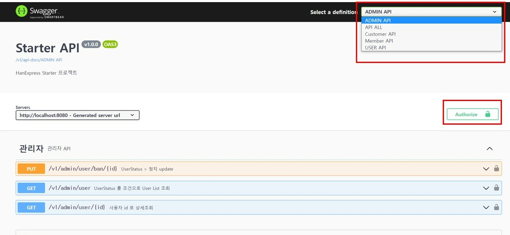

# 02. Project 사용 방법

### 1. Create User, DATABASE(DCL), Table (DDL)

**(필수)**
- [User, Database 생성](../db/dcl.sql)
- [테이블 생성 SQL](../db/create_table.sql)

**(선택 사항)**
- [User Data Insert SQL](../db/insert.sql)

**위 SQL 문**으로 User,Database, Table 생성후 H2 DB (Embedded DB) 를 사용하거나 설치된 Postgres DB 를 사용하면된다.

### 2. H2 console

```yaml
---
# application.yml
spring:
  profiles:
    active: local
---
# application-local.yml
spring:
  #### h2 ###
  h2:
  console:
    enabled: true
  datasource:
    driver-class-name: org.h2.Driver
    url: jdbc:h2:mem:starter;MODE=PostgreSQL;DATABASE_TO_LOWER=TRUE;DEFAULT_NULL_ORDERING=HIGH
    username: sa
    password:
```
application.yml 에서 profile 을 local 로 지정하면 application-local.yml 의 내용이 활성화된다.
브라우저에서 h2-console 접속
- URL : {server-address}**/h2-console**
    - ex) http://localhost:18080/h2-console


### 3. 로컬 테스트 용도 docker-compose
starter 프로젝트를 실행하기 위해 Postgres , kafka , redis 연결이 필요하다.  
개발 pc 에서 spring 프로젝트 개발을 위해 docker-compose 를 이용하여 개발에 필요한 것들을 설치할 수 있다.  


1. [docker-compose 로 Postgres 설치](etc/postgres-docker-compose.yml)  
  Postgres DB 를 설치해서 사용하고 싶다면 위 docker-compose.yml 를 이용하여 사용하면 된다.

2. [docker-compose 로 Redis 설치](etc/redis-docker-compose.yml)  
   stanalone 타입의 Redis 를 설치하여 사용할 수 있다.

3. [docker-compose 로 Kafka 설치](etc/kafka-docker-compose.yml)  
  kafka,zookeeper 를 설치하여 사용할 수 있다.

### 4. API TEST

**(!)**  starter API 테스트전에 **auth-service** 어플리케이션이 실행됐는지 확인해야한다.

auth-service 는 [GitHub](https://github.com/oscka/auth-service) 에서 clone 받는다.

#### 4.1. HTTP 파일을 이용한 API 테스트
사용하기전 http 확장자로 파일을 생성하고, IDE 가 필요하다.

- VSCode (IDE)
  - (httpYac - Rest Client) Extensions 설치
  - http 확장자인 파일 테스트

- IntelliJ (IDE)
  - Ultimate(유료) 일경우 http 테스트 사용가능  

- HTTP 파일 참고  
  - [User API 테스트](../http/users.http)  
  - [Admin API 테스트](../http/admin.http)
  - [고객사 (화주) API 테스트](../http/customer.http)  
  - [사용자 (실행사,택배사) API 테스트](../http/member.http)  


#### 4.2. swagger 를 이용한 API 테스트 
- {starter URL}**/swagger-ui/index.html** 으로 접속하면 Swagger 화면을 확인할 수 있다.
  - http://localhost:8080/swagger-ui/index.html



##### 4.2.1. 화면접속후 API 별 Grouping 이 돼있으므로 select box 에서 선택해야한다.
  - API ALL 을 선택하면 전체 API 를 확인 할 수 있다.
  - OpenApiConfig.java 에서 path 별 그룹설정을 확인할 수 있다.

##### 4.2.2. 토큰 발급후 Authorize 버튼을 클릭 > 발급받은 JWT 토큰을 세팅해준다.
  - 현재 User API 를 제외하고 모든 요청에서 JWT 토큰이 필요하도록 설정했다.
    - 해당 설정은 SecurityConfig.java 에서 확인가능
  - User API 의 로그인 API 를 이용하여 JWT 토큰을 auth-service 로부터 발급받아야한다.


